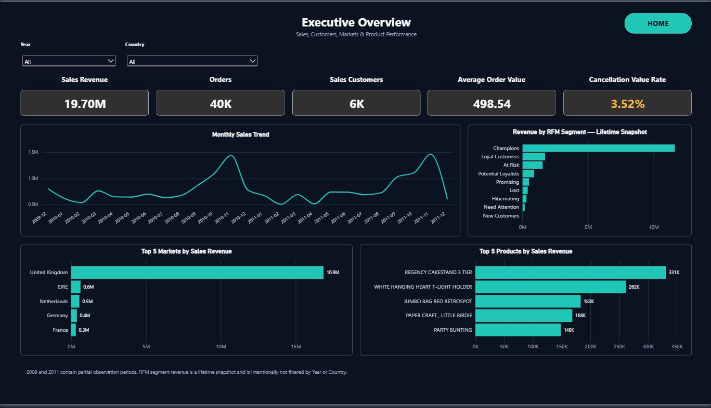
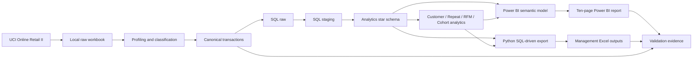
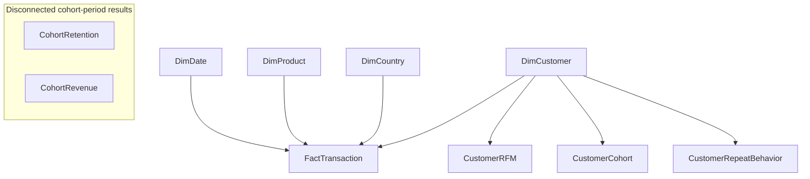
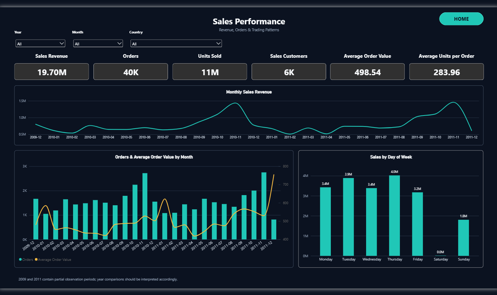
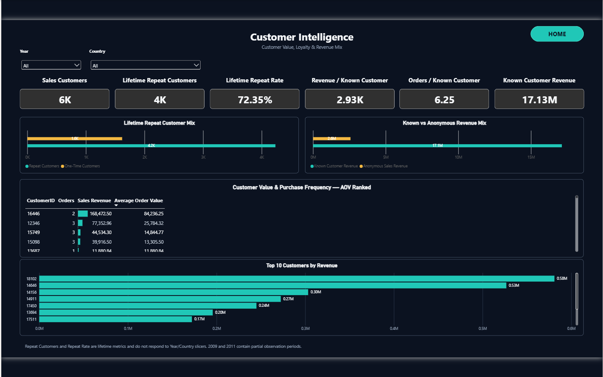
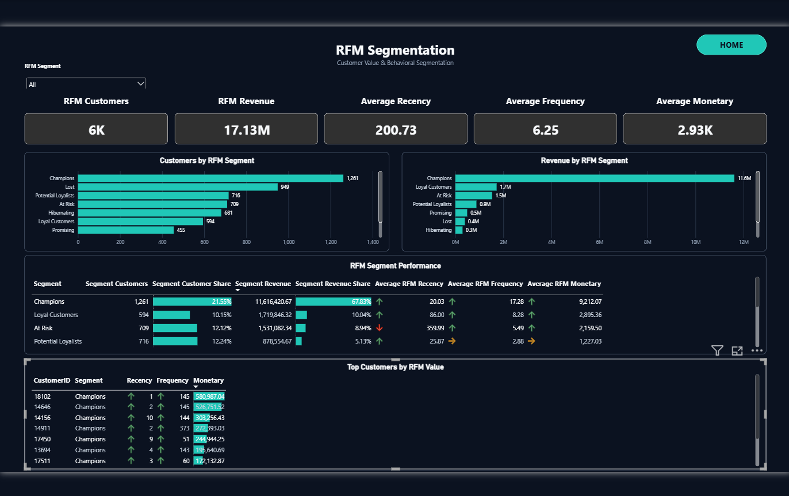
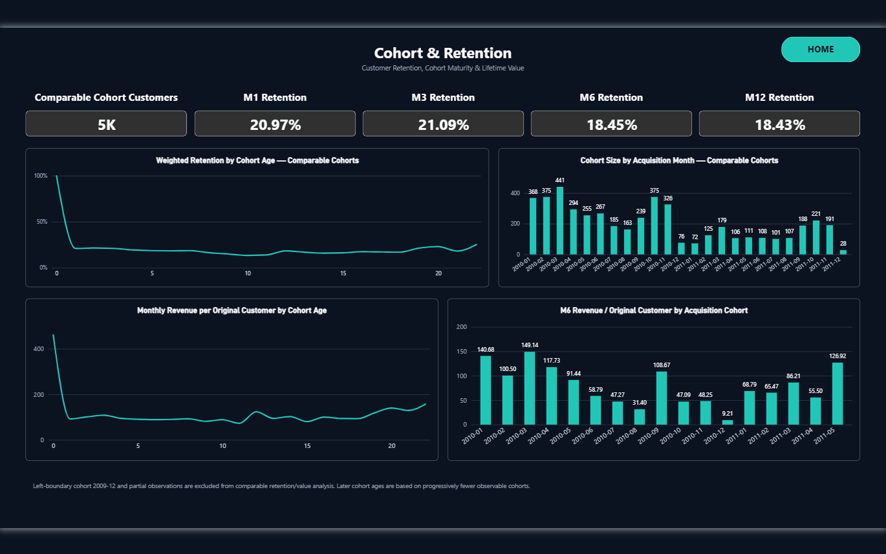
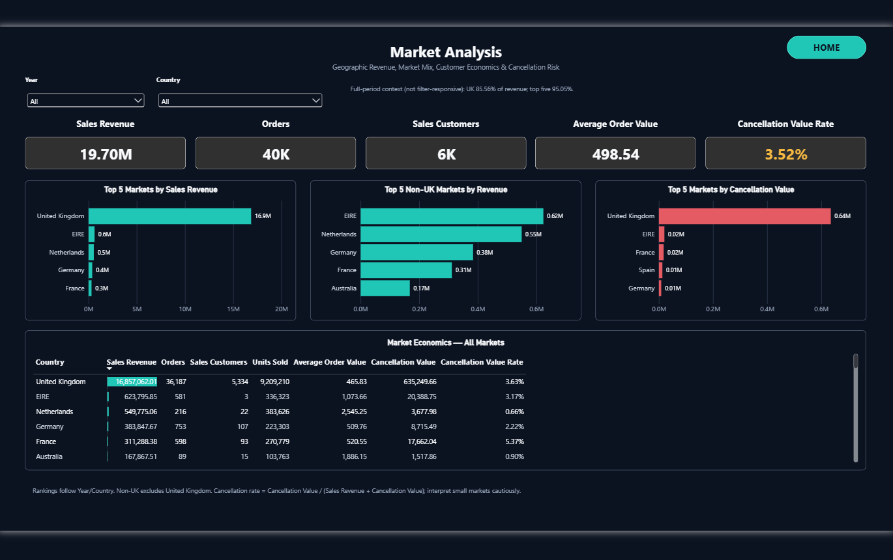
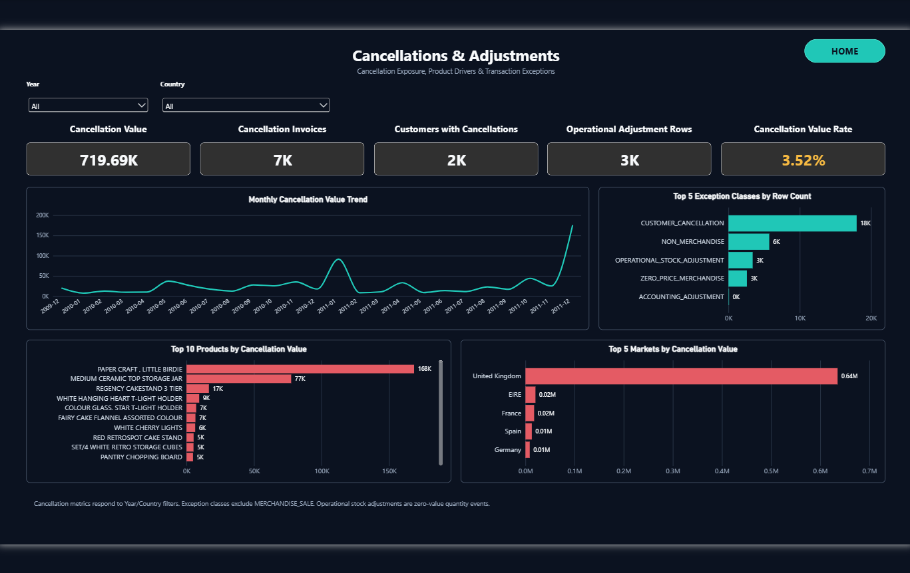
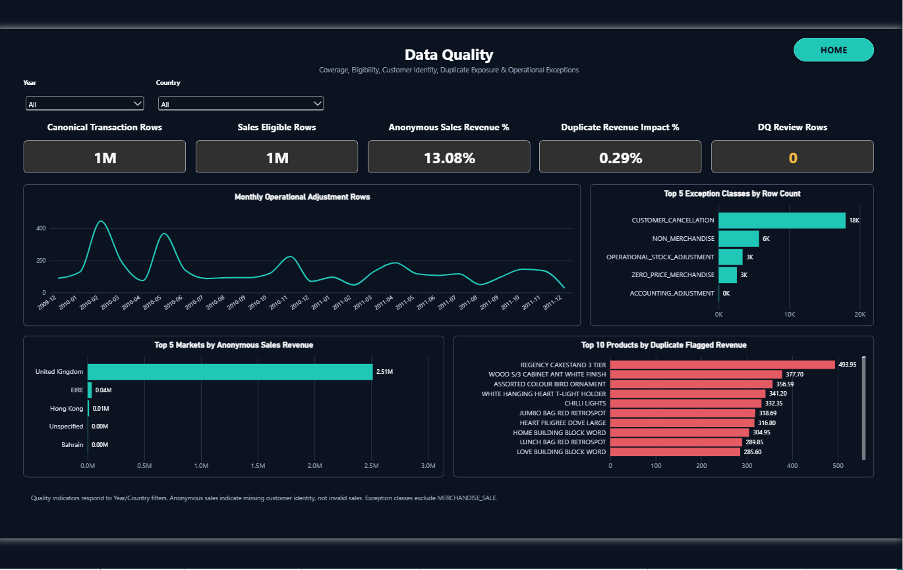

# Online Retail Growth & Customer Intelligence

An end-to-end analytics project using **SQL Server, Python, Power BI, DAX and Excel** to turn retail transactions into governed business reporting.
Explore revenue drivers, customer value, repeat purchasing, RFM segments, cohort retention and cancellation exposure across a validated analytical model and a ten-page report.

[Explore the report](docs/powerbi_report.md) · [Review the model](docs/data_model.md) · [Inspect validation](docs/validation.md) · [Management outputs](outputs/management/)



## Project Highlights

| Business baseline | Validated result | Delivery / quality | Result |
|---|---:|---|---:|
| Canonical transaction rows | 1,044,848 | Power BI pages | 10 |
| Sales Revenue | 19,701,685.507 | Visuals | 136 |
| Units Sold | 11,221,960 | DAX measures | 50 |
| Orders | 39,519 | Relationships | 7 |
| Sales Customers | 5,852 | TMDL files | 15 |
| Repeat / One-Time Customers | 4,234 / 1,618 | Structural QA | PASS |
| Repeat Customer Rate | 72.35% | Semantic QA | PASS |
| Cancellation Value | 719,692.94 | Excel export validation | PASS |
| Cancellation Value Rate | 3.5242% | Management workbooks | 2 |
| Anonymous Sales Revenue | 2,576,013.46 | Real report screenshots | 10 |

All monetary figures are **source-currency units**. Results describe the governed full dataset, not necessarily the filter state shown in a screenshot. The [validation record](outputs/management/management_export_validation.json) preserves exact reconciliation values; [KPI definitions](docs/kpi_dictionary.md) explain scope and denominators.

## Business questions

- What drives revenue, and which products and markets contribute most?
- Which customers generate the most value, and how strong is repeat purchasing?
- How can RFM segmentation support customer prioritization?
- How does cohort retention evolve?
- Where are cancellations concentrated, and which operational/accounting exceptions need separate treatment?
- What data-quality risks affect interpretation?

## Tech stack

**Data platform:** SQL Server · Python · pandas · NumPy · PyArrow · pyodbc  
**Reporting:** Power BI · Power Query · DAX · PBIP · PBIR · TMDL  
**Delivery:** Excel · openpyxl · matplotlib · Git · GitHub

## End-to-end architecture



Excel outputs are generated directly from SQL, not extracted from report visuals. See [architecture](docs/architecture.md).

## Star schema and customer analytics



Arrows show single-direction dimension filtering. The fact has transaction-line grain. Customer summaries have one row per customer; their semantic relationships use many-to-one cardinality to avoid bidirectional filtering. CohortRetention and CohortRevenue stay disconnected at acquisition-cohort × cohort-index grain. All 50 explicit measures live in `_Measures`. [Model detail and filter limitations](docs/data_model.md).

## Transaction governance

| Class | Analytical treatment |
|---|---|
| `MERCHANDISE_SALE` | Governed merchandise sales baseline |
| `CUSTOMER_CANCELLATION` | Separate cancellation exposure |
| `NON_MERCHANDISE` | Separate non-merchandise activity |
| `OPERATIONAL_STOCK_ADJUSTMENT` | Operational exceptions, excluded from normal sales |
| `ZERO_PRICE_MERCHANDISE` | Separately governed free/zero-price lines |
| `ACCOUNTING_ADJUSTMENT` | Accounting exceptions, excluded from normal sales |
| `TEST_RECORD` | Test records excluded from business sales |

Sales and cancellations are separated. Anonymous activity is retained in sales while customer-level analysis requires known identifiers. Duplicate exposure is flagged and quantified; preserved rows are not silently discarded. See [classification rules](docs/data_quality/TRANSACTION_CLASSIFICATION.md) and [data quality](docs/data_quality.md).

## Power BI report

| Page | Analytical purpose |
|---|---|
| 1. INDEX | Navigation to all analytical pages |
| 2. Executive Overview | Business performance at a glance |
| 3. Sales Performance | Revenue, orders and sales trends |
| 4. Customer Intelligence | Customer value and repeat purchasing |
| 5. RFM Segmentation | Snapshot customer prioritization |
| 6. Cohort & Retention | Acquisition cohorts and period retention |
| 7. Product Performance | Product contribution and concentration |
| 8. Market Analysis | Country contribution and market economics |
| 9. Cancellations & Adjustments | Cancellation exposure and exceptions |
| 10. Data Quality | Completeness, duplicates and governed classes |

The following are genuine, unedited report captures. [View all ten screenshots](screenshots/) or inspect the [native Power BI source](powerbi/README.md).

### Sales Performance



### Customer Intelligence



### RFM Segmentation



### Cohort & Retention



### Market Analysis



### Cancellations & Adjustments



### Data Quality



## Validated findings

- Revenue is approximately **19.70M** across **39,519 orders** and **5,852 known sales customers**.
- **4,234 repeat customers** represent approximately **72.35%** of sales customers.
- Cancellation value is approximately **719.69K**, with a governed cancellation value rate of **3.5242%**.
- Anonymous sales contribute approximately **2.576M** and remain visible in the revenue baseline.
- The **United Kingdom dominates recorded revenue**; the market page separates overall and non-UK comparisons.
- Cancellation exposure contains major product outliers, motivating product-level exception review.

These are descriptive findings, not evidence of causality. [SQL findings](docs/insights/SQL_BUSINESS_ANALYSIS_BASELINE.md) · [RFM analysis](docs/insights/RFM_CUSTOMER_SEGMENTATION.md) · [Cohort analysis](docs/insights/COHORT_RETENTION_ANALYSIS.md).

## Management deliverables

| Deliverable | Contents |
|---|---|
| [Management Analytics workbook](outputs/management/Online_Retail_Management_Analytics.xlsx) | 14 sheets of executive, sales, market, product, customer, RFM, cohort and exception summaries |
| [Analytical Detail workbook](outputs/management/Online_Retail_Analytical_Detail.xlsx) | 16 sheets of customer, product, market, cohort, cancellation and data-quality detail |
| [Export validation JSON](outputs/management/management_export_validation.json) | SQL reconciliation, nine reference baselines and saved-cell validation |

Python queries the governed SQL analytics layer and writes formatted Excel outputs. Saved analytical cells are reconciled to fresh SQL results. [Workbook documentation](outputs/management/README.md).

## Validation

The completed project's structural and semantic QA both passed: **10 pages, 136 visuals, 50 measures, seven relationships and 15 TMDL files**. Workbook evidence records **82,847** validated management cells and **433,816** validated detail cells, with SQL validation and reference reconciliation PASS.

[Validation overview](docs/validation.md) distinguishes historical checkpoint evidence from final report status. Publication packages the existing validated artifacts; it does not represent a fresh SQL refresh or Power BI Desktop execution.

## Reproduce the project

Prerequisites: Python 3.13-compatible environment, SQL Server, Microsoft ODBC Driver 18 for SQL Server, Windows authentication, and Power BI Desktop supporting the supplied PBIP/PBIR version. Use a dedicated development database: setup/load scripts create and populate `OnlineRetailAnalytics`.

1. Clone the repository, create a virtual environment, and install dependencies:

   ```powershell
   git clone https://github.com/khaledzidan203-stack/online-retail-growth-customer-intelligence.git
   cd online-retail-growth-customer-intelligence
   python -m venv .venv
   .\.venv\Scripts\Activate.ps1
   python -m pip install -r requirements.txt
   ```

2. Download the workbook from the [official UCI Online Retail II source](https://archive.ics.uci.edu/dataset/502/online+retail+ii). Place `online_retail_II.xlsx` in `data/raw/`; the workbook is intentionally excluded from Git. [Dataset instructions](data/README.md).

3. Profile, classify and load the canonical transactions:

   ```powershell
   python src/ingestion/profile_raw_dataset.py
   python src/cleaning/build_canonical_transactions.py
   python src/ingestion/load_sql_server.py --server localhost --driver "ODBC Driver 18 for SQL Server"
   python src/analytics/export_sql_analysis.py --server localhost
   ```

4. Build customer analytics and publish the validated outputs:

   ```powershell
   python src/analytics/eda.py --server localhost
   python src/analytics/rfm.py --server localhost
   python src/analytics/cohort.py --server localhost
   python src/ingestion/publish_customer_analytics.py --server localhost
   ```

5. Generate and validate the management workbooks:

   ```powershell
   python src/exports/management_export.py --server localhost --driver "ODBC Driver 18 for SQL Server"
   python src/exports/management_export.py --server localhost --driver "ODBC Driver 18 for SQL Server" --validate-only
   ```

6. Open `powerbi/OnlineRetailAnalytics.pbip` in Power BI Desktop. Configure SQL data-source access for your local instance, authenticate and refresh. Follow the [Power BI guide](powerbi/README.md). SQL execution order is documented in [sql/README.md](sql/README.md); Python entry points in [src/README.md](src/README.md).

## Limitations

There is no reliable **COGS, Profit, Gross Margin, Marketing Spend or Inventory Valuation** in this project. Monetary values use **source-currency units**; no currency conversion or profitability claim is made.

The observation window has partial years at both ends. Cohort results retain observation-boundary flags, and RFM is a snapshot. Distinct counts, rates and shares are nonadditive. Missing customer identifiers limit customer attribution; small-market cancellation rates can be volatile. Screenshots show captured filter states rather than a live embedded report.

## Repository guide

| Path | Start here for |
|---|---|
| [docs/](docs/) | Business problem, architecture, model, KPIs, governance and validation |
| [sql/](sql/README.md) | Raw → staging → analytics, business queries and reconciliation |
| [src/](src/README.md) | Profiling, classification, analysis, SQL publishing and export |
| [powerbi/](powerbi/README.md) | PBIP project, PBIR report and TMDL semantic model |
| [outputs/management/](outputs/management/README.md) | Ready-to-review workbooks and validation |
| [screenshots/](screenshots/README.md) | All ten authentic report captures |
| [data/](data/README.md) | Source acquisition and local-only data policy |
| [CHANGELOG.md](CHANGELOG.md) | Delivery history |

Dataset attribution: Chen, D. (2012), *Online Retail II*, UCI Machine Learning Repository, [DOI: 10.24432/C5CG6D](https://doi.org/10.24432/C5CG6D), licensed CC BY 4.0.
