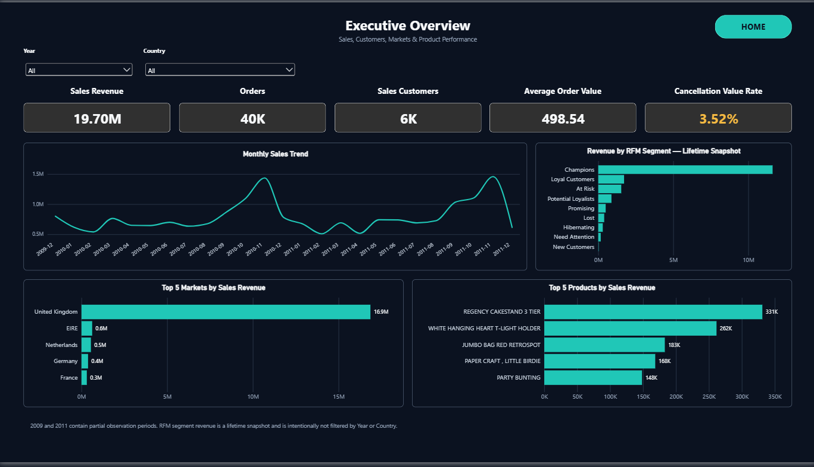
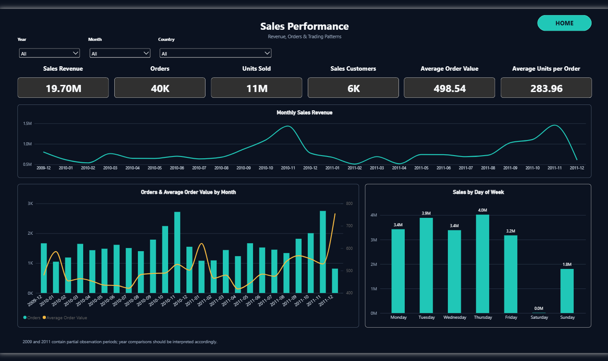
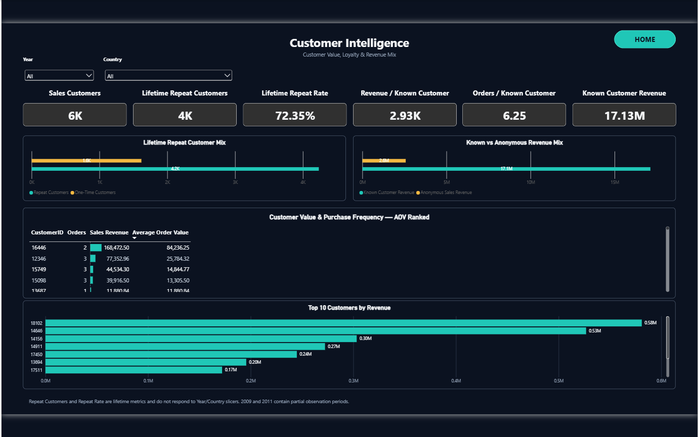
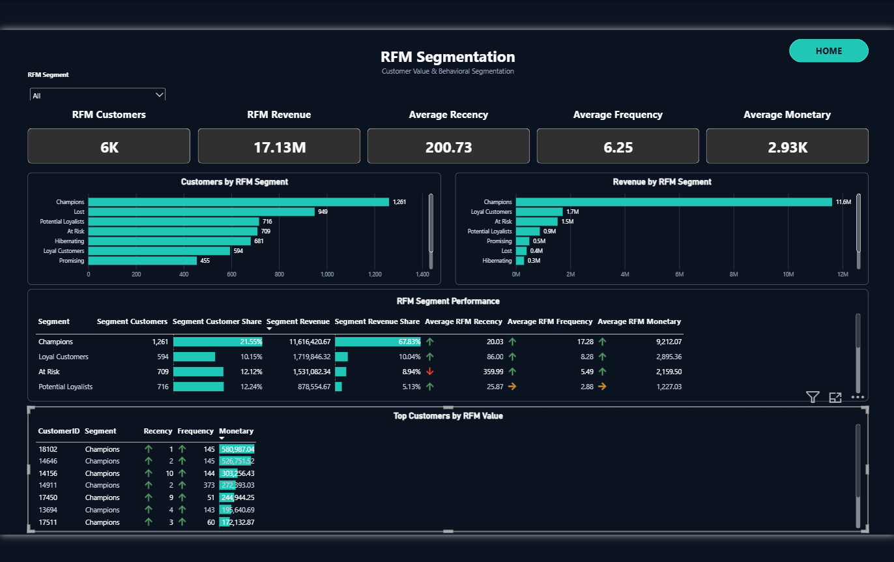
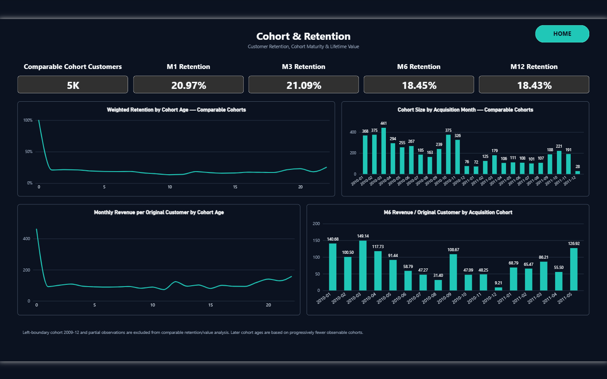
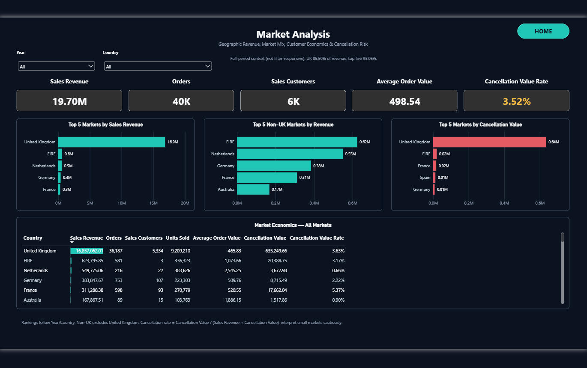
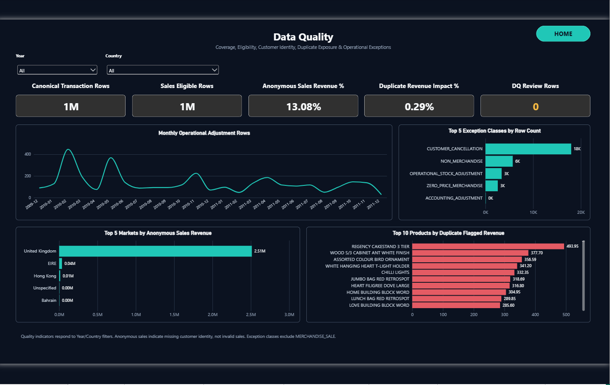

# Online Retail Growth & Customer Intelligence

## Governed Transaction Analytics, Customer Value, RFM, Cohorts & Power BI

[](https://github.com/khaledzidan203-stack/online-retail-growth-customer-intelligence/actions/workflows/repository-validation.yml)

Online Retail Growth & Customer Intelligence is an end-to-end retail analytics implementation built from the public **UCI Online Retail II** dataset. It combines Python data engineering, SQL Server modeling, customer analytics, source-controlled Power BI, and validated Excel management outputs.

> **Evidence boundary:** the raw UCI workbook and local canonical extract are intentionally excluded from Git. The repository retains the analytical source, native PBIP/PBIR/TMDL files, authentic report screenshots, management workbooks, and reconciliation evidence.



**Start here:** [Case study](docs/CASE_STUDY.md) · [Technical walkthrough](docs/TECHNICAL_WALKTHROUGH.md) · [Evidence map](docs/PROJECT_EVIDENCE_MAP.md) · [Project index](docs/PROJECT_INDEX.md) · [Final validation](docs/FINAL_RELEASE_VALIDATION.md)

## Project at a glance

| Analytical baseline | Validated result | Delivery / model | Validated result |
|---|---:|---|---:|
| Canonical transaction rows | 1,044,848 | Power BI pages | 10 |
| Sales Revenue | 19,701,685.507 | Visuals | 136 |
| Units Sold | 11,221,960 | Explicit DAX measures | 50 |
| Orders | 39,519 | Active relationships | 7 |
| Sales Customers | 5,852 | TMDL files | 15 |
| Repeat / One-Time Customers | 4,234 / 1,618 | Authentic report screenshots | 10 |
| Repeat Customer Rate | 72.35% | Management workbook sheets | 14 |
| Cancellation Value | 719,692.94 | Detail workbook sheets | 16 |
| Cancellation Value Rate | 3.5242% | Validated workbook cells | 82,847 + 433,816 |
| Anonymous Sales Revenue | 2,576,013.46 | SQL/reference reconciliation | PASS |

All monetary figures are **source-currency units**. No ISO currency conversion is asserted.

## Business problem

Retail transaction data can mix valid merchandise sales with cancellations, shipping/service rows, discounts, accounting adjustments, stock movements, test records, duplicate exposure, zero-price merchandise, and anonymous purchases.

The project is designed to answer:

- What drives revenue by time, product, customer, and market?
- How strong is repeat purchasing?
- Which customer groups deserve prioritization through RFM?
- How does retention evolve by acquisition cohort?
- Where are cancellations concentrated?
- How much valid sales activity is anonymous?
- Which data-quality or governance exposures affect interpretation?
- Can Power BI and Excel outputs reconcile to a governed SQL analytical baseline?

## End-to-end architecture

```text
UCI Online Retail II
        ↓
Python profiling and classification
        ↓
Canonical transaction model
        ↓
SQL Server raw → staging → analytics
        ↓
Star schema + governed KPI views
        ↓
Repeat / RFM / Cohort analytics
        ↓
┌───────────────────────────┬─────────────────────────┐
│ Power BI PBIP/PBIR/TMDL   │ SQL-driven Excel export│
│ 10-page report            │ Management deliverables│
└───────────────────────────┴─────────────────────────┘
        ↓
Validation / reconciliation evidence
```

Excel outputs are generated from SQL queries, not extracted from report visuals.

## Transaction governance

| Transaction class | Analytical treatment |
|---|---|
| `MERCHANDISE_SALE` | Governed merchandise-sales baseline |
| `CUSTOMER_CANCELLATION` | Separate cancellation exposure |
| `NON_MERCHANDISE` | Separate non-merchandise activity |
| `OPERATIONAL_STOCK_ADJUSTMENT` | Operational exception; excluded from normal sales |
| `ZERO_PRICE_MERCHANDISE` | Separately governed zero/free-price merchandise |
| `ACCOUNTING_ADJUSTMENT` | Accounting exception; excluded from normal sales |
| `TEST_RECORD` | Excluded from business sales |

Important rules:

- cancellations are not silently netted into sales;
- anonymous merchandise sales remain in revenue;
- customer-level metrics require a known customer identifier;
- duplicate exposure is flagged and quantified rather than silently dropped;
- operational and accounting adjustments remain analytically separate.

See [Transaction Classification](docs/data_quality/TRANSACTION_CLASSIFICATION.md).

## SQL analytical model

The SQL Server database is:

`OnlineRetailAnalytics`

Core layers:

- raw canonical landing;
- typed staging;
- `DimDate`;
- `DimCustomer`;
- `DimProduct`;
- `DimCountry`;
- `FactTransaction`;
- customer repeat behavior;
- RFM;
- customer cohort;
- cohort retention;
- cohort revenue;
- analytical validation and business views.

### Grain

`FactTransaction` is one canonical transaction line.

CustomerRFM, CustomerCohort, and CustomerRepeatBehavior are one row per customer.

CohortRetention and CohortRevenue use acquisition-cohort × cohort-index grain.

See [SQL guide](sql/README.md) and [data model](docs/data_model.md).

## Customer intelligence

### Repeat purchasing

Retained evidence records:

- Sales Customers: **5,852**
- Repeat Customers: **4,234**
- One-Time Customers: **1,618**
- Repeat Customer Rate: **72.35%**

### RFM

The project publishes snapshot customer segmentation using:

- Recency
- Frequency
- Monetary value
- governed segment labels

RFM is a **snapshot**, not a dynamically re-segmented history.

### Cohorts

The model retains acquisition cohort, cohort index, active customers, retention rate, cohort revenue, and observation-boundary context.

CohortRetention and CohortRevenue intentionally remain disconnected in Power BI because their aggregated grain is incompatible with the transaction/customer relationships.

## Power BI implementation

This repository contains an **actual source-controlled Power BI project**, not only a design guide.

Committed artifacts include:

- `powerbi/OnlineRetailAnalytics.pbip`
- PBIR report definitions
- TMDL semantic-model source
- DAX measures
- Power Query partitions

Validated structure:

- **10 pages**
- **136 visuals**
- **50 explicit DAX measures**
- **7 active single-direction relationships**
- **15 TMDL files**

All explicit measures are hosted in the disconnected `_Measures` table.

### Report pages

| # | Page |
|---:|---|
| 1 | INDEX |
| 2 | Executive Overview |
| 3 | Sales Performance |
| 4 | Customer Intelligence |
| 5 | RFM Segmentation |
| 6 | Cohort & Retention |
| 7 | Product Performance |
| 8 | Market Analysis |
| 9 | Cancellations & Adjustments |
| 10 | Data Quality |

See [Power BI source guide](powerbi/README.md) and [report guide](docs/powerbi_report.md).

## Authentic report evidence

The repository retains ten genuine report captures.

### Sales Performance



### Customer Intelligence



### RFM Segmentation



### Cohort & Retention



### Market Analysis



### Data Quality



[View all report captures](screenshots/README.md).

## Management Excel deliverables

| Deliverable | Validated contents |
|---|---|
| [Management Analytics workbook](outputs/management/Online_Retail_Management_Analytics.xlsx) | 14 sheets; 82,847 validated cells |
| [Analytical Detail workbook](outputs/management/Online_Retail_Analytical_Detail.xlsx) | 16 sheets; 433,816 validated cells |
| [Validation record](outputs/management/management_export_validation.json) | SQL validation PASS + reference reconciliation PASS |

The export pipeline reads governed SQL analytics and writes formatted workbooks with openpyxl.

Saved analytical cells were reconciled against SQL results in the retained validation record.

## Validated analytical findings

Retained evidence supports:

- Revenue of approximately **19.70M** across **39,519 orders**.
- **5,852** known sales customers.
- **4,234** repeat customers and a repeat rate of approximately **72.35%**.
- Cancellation Value of approximately **719.69K**.
- Cancellation Value Rate of approximately **3.5242%**.
- Anonymous Sales Revenue of approximately **2.576M**.
- The United Kingdom dominates recorded revenue in the retained analysis.
- Cancellation exposure includes large product-level outliers that merit separate exception review.

These are **descriptive findings**, not causal claims.

## Validation model

### Fresh GitHub CI

The repository workflow validates committed evidence without requiring the external UCI workbook, SQL Server, or Power BI Desktop.

Fresh CI checks:

- protected analytical-core Git blob hashes;
- management-validation JSON baselines;
- PBIR JSON validity;
- Power BI page / visual / measure / relationship / TMDL counts;
- workbook ZIP structure and sheet counts;
- screenshot set integrity;
- raw/local-data exclusions;
- publication boundary;
- common public-text secret and private-network patterns;
- repository regression tests.

### Historical / retained evidence

Historical / retained evidence records support:

- SQL validation PASS;
- SQL/reference reconciliation PASS;
- Power BI structural/semantic QA PASS;
- Excel saved-cell reconciliation PASS;
- completed report screenshots.

A successful current GitHub Action **does not mean SQL Server or Power BI Desktop was freshly executed in CI**.

See [Final Release Validation](docs/FINAL_RELEASE_VALIDATION.md).

## Reproduce the full project

### Requirements

- Python 3.13-compatible environment
- SQL Server / SQL Server Express
- Microsoft ODBC Driver 18 for SQL Server
- Power BI Desktop compatible with the committed PBIP/PBIR version

### 1. Install Python dependencies

```powershell
python -m venv .venv
.\.venv\Scripts\Activate.ps1
python -m pip install -r requirements.txt
```

### 2. Obtain the public source workbook

Download **UCI Online Retail II** from the official UCI Machine Learning Repository and place:

`online_retail_II.xlsx`

under:

`data/raw/`

The raw workbook is intentionally excluded from Git.

### 3. Build the governed transaction pipeline

```powershell
python src/ingestion/profile_raw_dataset.py
python src/cleaning/build_canonical_transactions.py
python src/ingestion/load_sql_server.py --server localhost --driver "ODBC Driver 18 for SQL Server"
python src/analytics/export_sql_analysis.py --server localhost
```

### 4. Build customer intelligence

```powershell
python src/analytics/eda.py --server localhost
python src/analytics/rfm.py --server localhost
python src/analytics/cohort.py --server localhost
python src/ingestion/publish_customer_analytics.py --server localhost
```

### 5. Generate management workbooks

```powershell
python src/exports/management_export.py --server localhost --driver "ODBC Driver 18 for SQL Server"
python src/exports/management_export.py --server localhost --driver "ODBC Driver 18 for SQL Server" --validate-only
```

### 6. Open the Power BI project

Open:

`powerbi/OnlineRetailAnalytics.pbip`

Configure the SQL Server source for the local development instance and refresh.

## Repository validation

Run the public artifact contract locally:

```powershell
python scripts/validate_repository.py
python -m unittest discover -s tests -p "test_*.py" -v
```

## Repository structure

```text
config/                 governed classification configuration
data/                   acquisition instructions; raw/local data excluded
sql/                    SQL Server raw, staging, analytics, analysis, validation
src/                    Python profiling, cleaning, analytics, publishing, export
powerbi/                PBIP / PBIR / TMDL / DAX source
outputs/management/     validated Excel deliverables + reconciliation JSON
screenshots/             ten authentic Power BI report captures
docs/                   architecture, KPIs, governance, evidence, validation
scripts/                public repository validator
tests/                  committed artifact regression tests
```

## Limitations

- No reliable COGS, Profit, Gross Margin, Inventory Valuation, ROI, or Marketing-Spend metric is supported by the source.
- Monetary values use source-currency units.
- Observation coverage includes partial years at both ends.
- RFM is a snapshot.
- Cohort-period outputs are precomputed and disconnected in Power BI.
- Distinct counts, rates, shares, and ranks are nonadditive.
- Anonymous customer IDs limit customer-level attribution.
- Small-market cancellation rates may be volatile.
- Report screenshots represent captured filter states rather than a live embedded report.
- Current GitHub CI does not provision SQL Server or Power BI Desktop.

## Documentation

- [Project Index](docs/PROJECT_INDEX.md)
- [Case Study](docs/CASE_STUDY.md)
- [Technical Walkthrough](docs/TECHNICAL_WALKTHROUGH.md)
- [Project Evidence Map](docs/PROJECT_EVIDENCE_MAP.md)
- [Architecture](docs/architecture.md)
- [Data Model](docs/data_model.md)
- [KPI Dictionary](docs/kpi_dictionary.md)
- [Data Quality](docs/data_quality.md)
- [Validation](docs/validation.md)
- [Power BI Source](powerbi/README.md)
- [Management Outputs](outputs/management/README.md)
- [Final Release Validation](docs/FINAL_RELEASE_VALIDATION.md)

Dataset attribution: Chen, D. (2012), *Online Retail II*, UCI Machine Learning Repository, DOI 10.24432/C5CG6D, CC BY 4.0.
