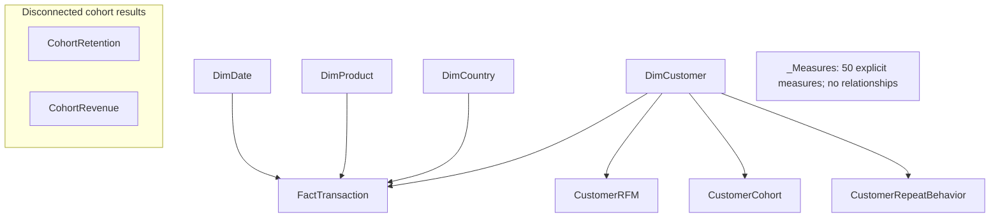

# Data model

The SQL analytical model stores one canonical transaction line per `FactTransaction` row. Four dimensions support sales, product, market and customer analysis. Power BI uses seven active, single-direction many-to-one relationships; arrows below show filter propagation from each dimension to its dependent tables.

| Table | Grain / role |
|---|---|
| FactTransaction | One canonical transaction line; 1,044,848 rows |
| DimDate | One calendar date; governed date table |
| DimCustomer | One known customer identifier; anonymous fact activity is retained without a known customer match |
| DimProduct | One governed product key |
| DimCountry | One country key |
| CustomerRFM | One row per customer key; snapshot segmentation |
| CustomerCohort | One row per customer key; acquisition cohort |
| CustomerRepeatBehavior | One row per customer key; repeat purchasing |
| CohortRetention / CohortRevenue | One acquisition cohort × cohort index |
| _Measures | Dedicated measure host; no business data |

The three customer summary tables are unique by customer in SQL. Their Power BI relationships deliberately use many-to-one cardinality to retain single-direction filtering. Cohort result tables remain disconnected because their aggregated grain is incompatible with transaction/customer relationships. Do not infer that calendar or country slicers dynamically recompute snapshot RFM or disconnected cohort results.

See the [semantic model specification](powerbi/POWER_BI_SEMANTIC_MODEL.md), [SQL star schema](architecture/SQL_STAR_SCHEMA.md) and [DAX dictionary](powerbi/DAX_MEASURE_DICTIONARY.md) for implementation detail.
